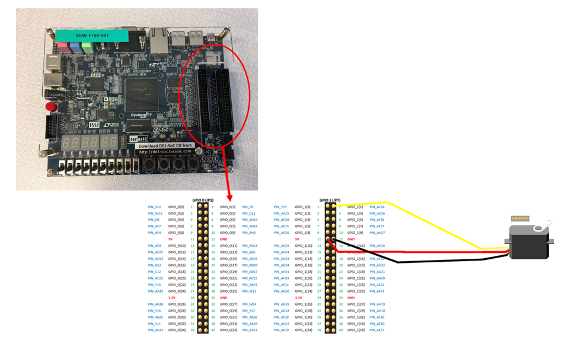

# Control-of-Servo-motor-with-DE1-SoC
This project takes place in the Hardware/Software Platforms lesson in first master in Electrical Engineering of the Faculty of Engineering of Mons.   The goal of this project is to control a servo-motor with a DE1-SoC Board. It introduces you to learn VHDL programming language and to handle an entiere electronical project.
-> Group Members: Elora Amorison & Clelia Galvanin
-> Project title: Control of a servo-motor with a DE1-SoC

The goal is to control the servo-motor with the button available on the board by the user. We use a DE1-SoC processor. The software used to create our program is "Quartus II". Our program is separated in three main parts interpreted in VHDL code. 

Here is the connection between the servo-motor and the processor:

There are 4 parts in our code. The first one, called "Clk64kHz.vhd", is the construction of the clock of 64kHz. The file called "Servo_pwm.vhd" is the code building the PWM signal to control the servomotor. The third file "servo_pwm_clk64kHz.vhd" is there to glue these two first files to build the final version of the control signal. The last file you need is the "servo_pwm_clk64kHz_ITFDE1.vhd" that connects the signals with the pins of the board. 

You can download the DE1-SoC-servo zip file with all the files in it. You can also download the presentation of this project called "HardwareSoftware-Presentation.pdf" or the entire written tutorial named "Hardware Software.pdf"

Here is the link of our Youtube video: https://www.youtube.com/watch?v=HVyE35rkSaQ&t=5s

